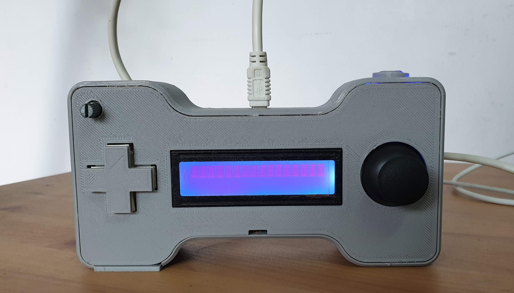

# Bi-Directional Arduino Remote Control with nRF24

## Overview
This Repository contains the codes and 3D printed files for a bi-directional Arduino remote control that is capable of checking if the remote is connected to the client, with LED lights inside the remote. The chip used for wireless connectivity is the nRF24L01 and the remote is powered by a 9V battery.

The 3D modeling was done using Fusion 360 and the files are available. More details can be found on my blog:
https://endervastrobotics.wordpress.com/2020/04/21/3d-printed-arduino-remote-control/
